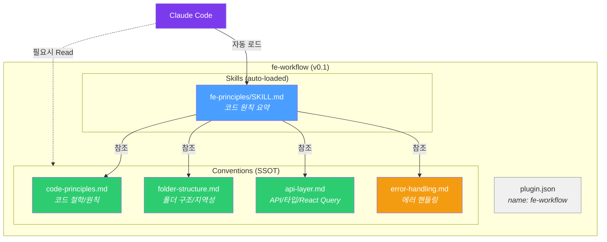
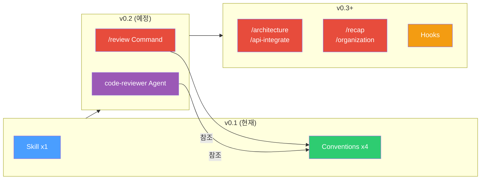

# fe-workflow v0.1 Architecture

## Legend

| 색상 | 의미 |
|------|------|
| Blue | Skill (자동 로드) |
| Green | Convention (톤 정리 완료) |
| Orange | Convention (톤 정리 추후) / Hook |
| Red | Command |
| Purple | Agent / Claude Code |
