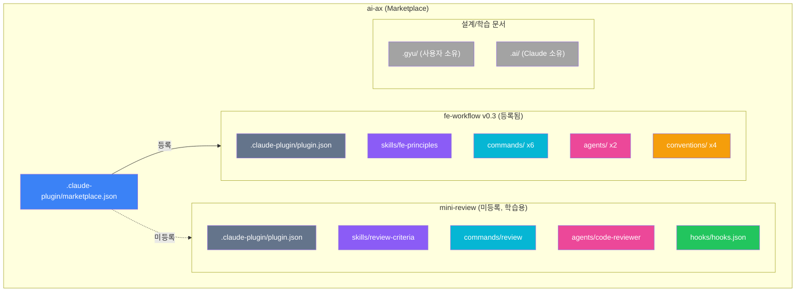
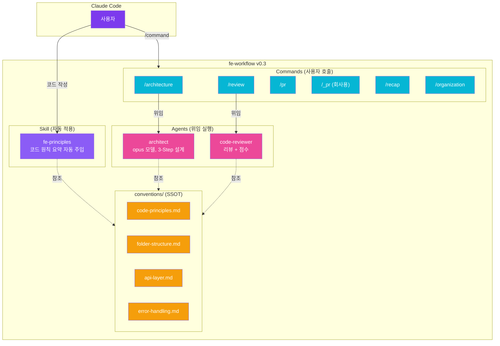
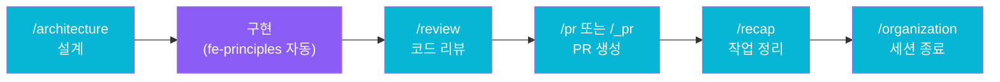

# ai-ax v0.3 Architecture

## 레포 전체 구조



## fe-workflow v0.3 상세



## 워크플로우



## 파일 구조

```
ai-ax/
├── .claude-plugin/
│   └── marketplace.json           ← 마켓플레이스 등록 (fe-workflow만)
├── .claude/
│   ├── settings.json              ← hooks 설정
│   └── settings.local.json        ← 권한 설정
├── .gyu/                          ← 사용자 소유 (설계/학습 문서)
├── .ai/                           ← Claude 소유 (세션 상태)
│
├── fe-workflow/                   ← 메인 플러그인 v0.3
│   ├── .claude-plugin/plugin.json
│   ├── skills/fe-principles/      ← Skill x1
│   ├── commands/                  ← Command x6
│   │   ├── architecture.md
│   │   ├── review.md
│   │   ├── pr.md
│   │   ├── _pr.md (회사용)
│   │   ├── recap.md
│   │   └── organization.md
│   ├── agents/                    ← Agent x2
│   │   ├── architect.md
│   │   └── code-reviewer.md
│   └── conventions/               ← Convention x4 (SSOT)
│       ├── code-principles.md
│       ├── folder-structure.md
│       ├── api-layer.md
│       └── error-handling.md
│
└── mini-review/                   ← 학습용 (마켓플레이스 미등록)
```

## 범례

| 색상 | 컴포넌트 |
|------|----------|
| 보라 | Skill (자동 적용) |
| 파랑 | Command (사용자 호출) |
| 핑크 | Agent (위임 실행) |
| 노랑 | Convention (지식 소스) |
| 초록 | Hook (이벤트 기반) |
| 회색 | 메타/문서 |
