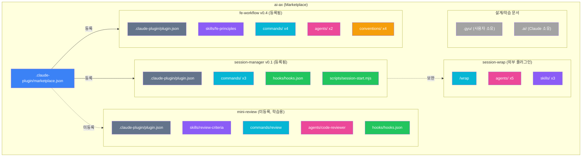
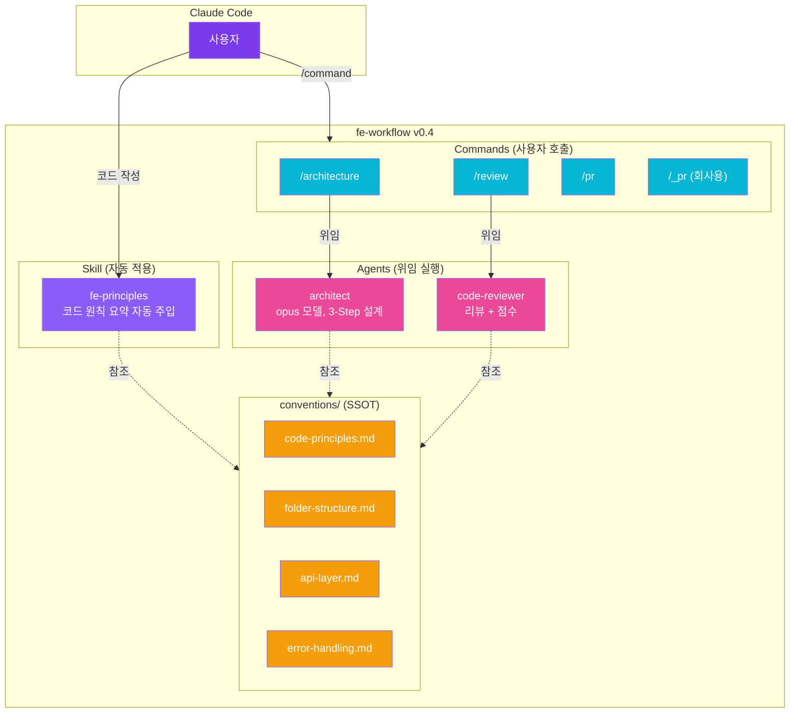
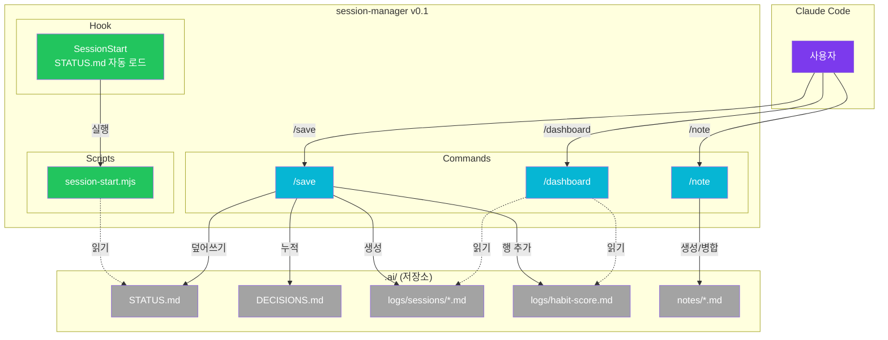
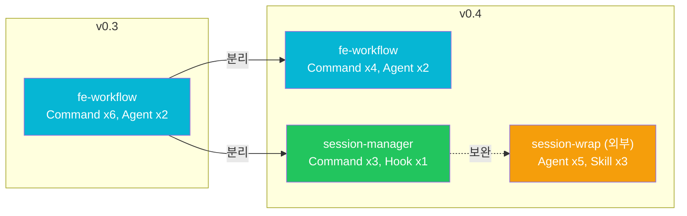

# ai-ax v0.4 Architecture

## 레포 전체 구조



## 플러그인 상세 — fe-workflow v0.4



## 플러그인 상세 — session-manager v0.1



## 통합 워크플로우


## v0.3 → v0.4 변경점



| 항목 | v0.3 | v0.4 |
|------|------|------|
| 플러그인 수 | 1 (fe-workflow) | 2 (fe-workflow + session-manager) + 외부 1 |
| fe-workflow Commands | 6개 | 4개 (recap, organization 분리) |
| session-manager | 없음 | /save, /dashboard, /note + SessionStart Hook |
| 세션 분석 | /organization (단순) | /wrap (외부, 5-Agent 파이프라인) |
| 습관 측정 | 없음 | AI 협업 점수 /10 + habit-score 추적 |
| 학습 기록 | 없음 | /note (5 카테고리, .ai/notes/) |

## 파일 구조

```
ai-ax/
├── .claude-plugin/
│   └── marketplace.json           ← fe-workflow + session-manager 등록
├── .gyu/                          ← 사용자 소유 (설계/학습 문서)
├── .ai/                           ← Claude 소유 (세션 상태)
│   ├── STATUS.md
│   ├── DECISIONS.md
│   ├── notes/                     ← /note 산출물
│   └── logs/
│       ├── habit-score.md
│       └── sessions/
│
├── fe-workflow/                   ← FE 워크플로우 v0.4
│   ├── .claude-plugin/plugin.json
│   ├── skills/fe-principles/      ← Skill x1
│   ├── commands/                  ← Command x4
│   │   ├── architecture.md
│   │   ├── review.md
│   │   ├── pr.md
│   │   └── _pr.md (회사용)
│   ├── agents/                    ← Agent x2
│   │   ├── architect.md
│   │   └── code-reviewer.md
│   └── conventions/               ← Convention x4 (SSOT)
│       ├── code-principles.md
│       ├── folder-structure.md
│       ├── api-layer.md
│       └── error-handling.md
│
├── session-manager/               ← 세션 상태 관리 v0.1
│   ├── .claude-plugin/plugin.json
│   ├── commands/                  ← Command x3
│   │   ├── save.md
│   │   ├── dashboard.md
│   │   └── note.md
│   ├── hooks/hooks.json           ← Hook x1
│   └── scripts/session-start.mjs
│
└── mini-review/                   ← 학습용 (마켓플레이스 미등록)
```

## 범례

| 색상 | 컴포넌트 |
|------|----------|
| 보라 | Skill (자동 적용) |
| 파랑 | Command (사용자 호출) |
| 핑크 | Agent (위임 실행) |
| 노랑 | Convention (지식 소스) / 외부 플러그인 |
| 초록 | Hook / Script (이벤트 기반) |
| 회색 | 메타/문서/저장소 |
